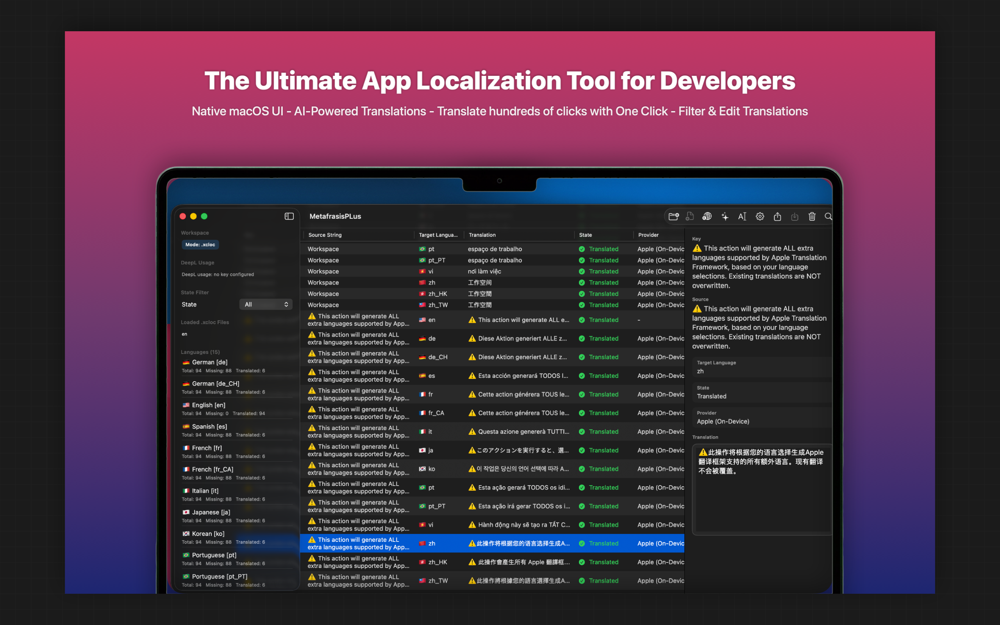
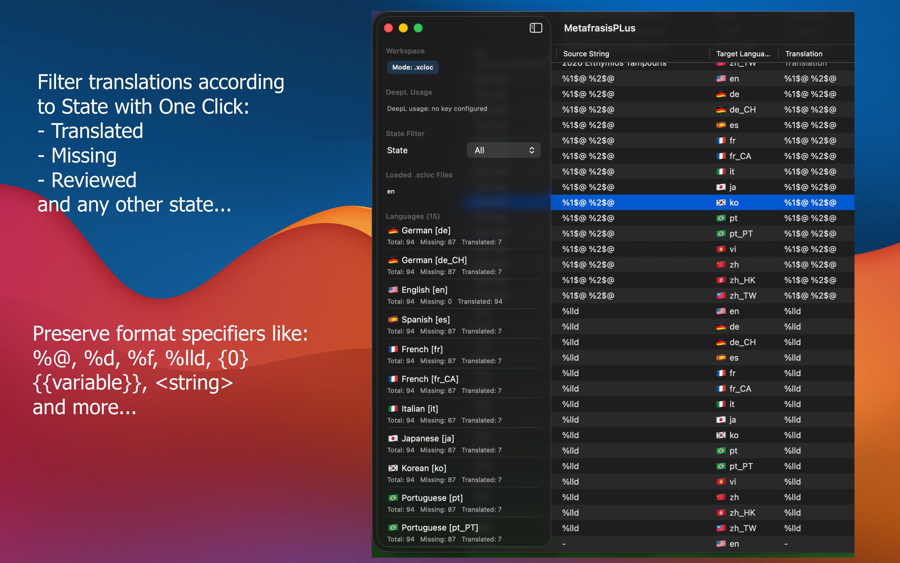
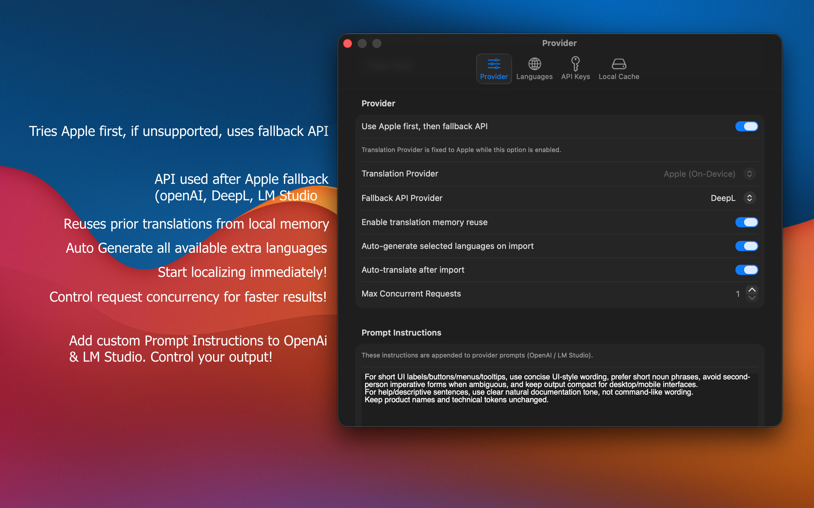
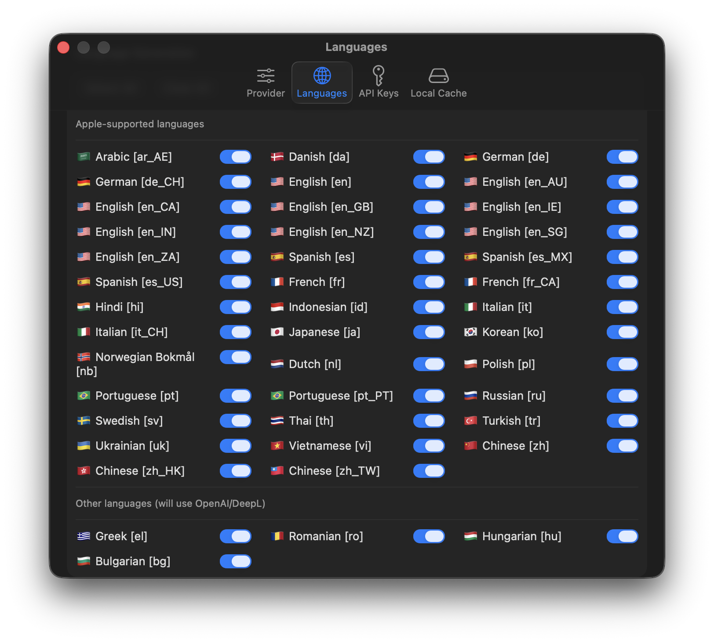

# 🚀 MetafrasisPLus for macOS  
### The Fastest, Smartest Way to Localize Your Apps — Powered by Native macOS Tech

MetafrasisPLus is a **native macOS localization powerhouse** built for developers, translators, and teams who want to translate `.xcloc` bundles **fast**, **accurately**, and with **zero friction**.  
Designed with Swift + SwiftUI, optimized for macOS, and enhanced with Apple’s modern frameworks, MetafrasisPLus turns localization into a smooth, automated workflow.

Whether you're shipping a multilingual app or maintaining a global product, MetafrasisPLus gives you the tools to translate smarter — not harder.

---

---

## ✨ Key Features

### 🔍 **Import `.xcloc` Files Instantly**
- Drag & drop `.xcloc` bundles directly from Finder  
- Import individual files or entire language folders  
- Automatic detection of default language + target language  
- Clean, structured workspace with keys, source strings, and translation columns

---

---

## ⚡ **Automatic Translation Engines**
Choose the engine that fits your workflow:

### 🧠 **Apple Translation (On‑Device)**
- Fast, private, and offline  
- Perfect for quick translations and testing  
- Included in the Free tier

### 🤖 **LM Studio (Local LLMs)**
- Run your own local models  
- Zero cloud dependency  
- Pro‑only feature

### 🌐 **DeepL API**
- Industry‑leading translation quality  
- Ideal for production‑ready localization  
- Pro‑only feature

### 🔥 **OpenAI API**
- Smart, context‑aware translations  
- Great for nuanced or domain‑specific content  
- Pro‑only feature

---

---

## 🧩 **Workspace Designed for Developers**
- View keys, source strings, and translations side‑by‑side  
- Real‑time translation updates  
- Translation state indicators (translated, missing, needs review)  
- Filters for translation status  
- Inline editing for fine‑tuning translations  
- Multi‑language overview panel

---

## 💾 **Smart Storage Options**
### 🕒 **Session Storage**
- Keeps your current workspace alive  
- Restore your translation progress even after quitting  
- Pro‑only toggle

### 🗄️ **SQL Translation Memory**
- Stores previous translations for reuse  
- Speeds up repetitive localization tasks  
- Pro‑only feature

### 🧹 **Reset Tools**
- **Clear Loaded Translation**: resets the current workspace  
- **Reset Local Cache**: clears session + SQL memory  
- Perfect for starting fresh

---

## 📤 **Export Back to Xcode**
- Export `.xcloc` bundles ready for Xcode  
- Clean, validated output  
- Supports all 42+ languages  
- Free tier includes limited exports per month  
- Pro tier unlocks unlimited exports

---

## 🌍 **Supports 42+ Languages**
From Greek to Korean, Romanian to Japanese, MetafrasisPLus handles a wide range of languages with ease.

---

---

## 🧪 **Batch Translation & Automation (Pro)**
- Translate entire files in one click  
- Batch‑process multiple `.xcloc` bundles  
- Group translations by language  
- Future‑ready architecture for `.xcstrings` support

---

## 🖥️ **Native macOS Experience**
- Built with Swift + SwiftUI  
- Liquid Glass UI  
- Smooth animations  
- Fast, responsive, and optimized for Apple Silicon  
- No Electron, no web wrappers — 100% native

---

## 🔐 **Privacy‑First Design**
- On‑device translation options  
- No unnecessary cloud calls  
- Your `.xcloc` files stay on your machine  
- You control which engines you use

---

## 🆓 Free Tier vs Pro Tier

### **Free Tier**
- Import 1 `.xcloc` file per session  
- Translate 1 target language per session  
- Apple Translation only  
- Limited exports per month  
- No session persistence  
- No SQL translation memory  
- No batch translation  
- No LM Studio / DeepL / OpenAI

### **Pro Tier**
- Unlimited `.xcloc` imports  
- Unlimited languages  
- Unlimited exports  
- Session persistence  
- SQL translation memory  
- Batch translation  
- LM Studio, DeepL, OpenAI  
- Folder import  
- Future features included

---

## 📦 Installation
MetafrasisPLus is distributed via the **Mac App Store**.  
(App Store link - soon)

---

## 🧭 Roadmap
- `.xcstrings` direct editing  
- Advanced grouping by language  
- Team collaboration features  
- Translation quality scoring  
- More automation tools

---

## ❤️ Built for Developers & Translators
MetafrasisPLus was created to remove the pain from localization workflows.  
If you build apps for a global audience, this tool will save you hours — every single release.

---

## 📬 Feedback & Support
Have ideas, feature requests, or found a bug?  
Open an issue or reach out — your feedback shapes the future of MetafrasisPLus.

---

## 🛠️ License
(license - soon)

