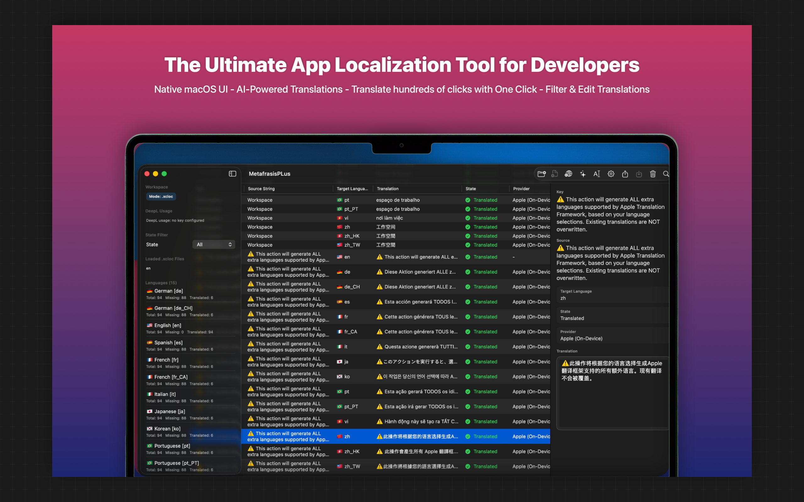
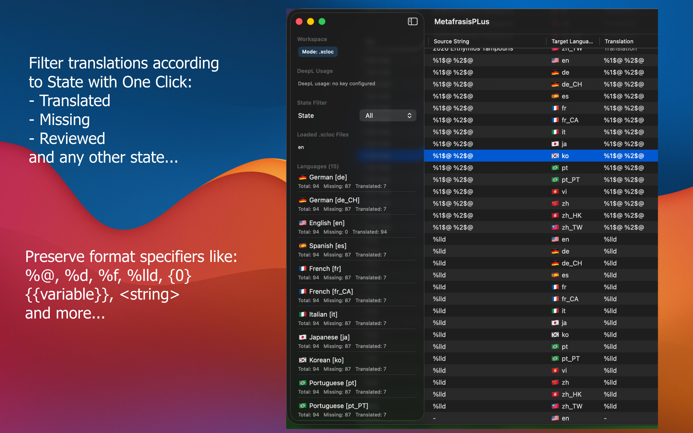
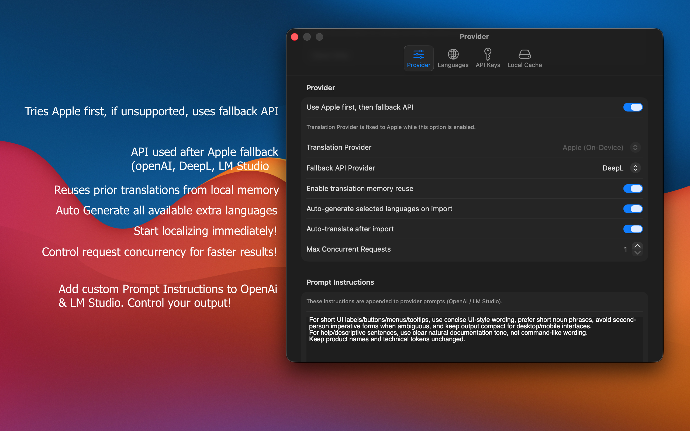
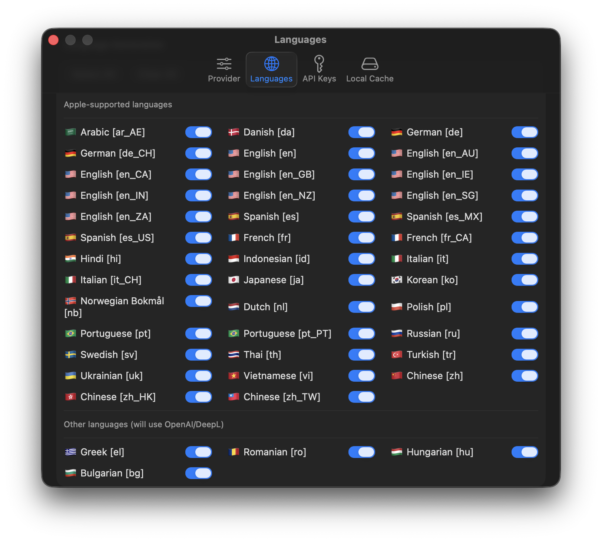

<a href="https://apps.apple.com/us/app/metafrasisplus/id6762572435?mt=12&itscg=30200&itsct=apps_box_artwork&mttnsubad=6762572435" style="position: relative; width: 70px; height: 70px; overflow: hidden; display: inline-block; vertical-align: middle; 
    --app-icon-mask: url('data:image/svg+xml,%0A%3Csvg%20xmlns%3D%22http%3A%2F%2Fwww.w3.org%2F2000%2Fsvg%22%20xml%3Aspace%3D%22preserve%22%20viewBox%3D%220%200%20230.5%20230.5%22%3E%0A%20%20%3Cpath%20fill-rule%3D%22evenodd%22%20stroke-linejoin%3D%22round%22%20stroke-miterlimit%3D%221.4%22%20clip-rule%3D%22evenodd%22%20d%3D%22M158.2%20230H64.1a320%20320%200%200%201-7-.1c-5%200-10-.5-15-1.3a50.8%2050.8%200%200%201-14.4-4.8%2048.2%2048.2%200%200%201-21-21%2050.9%2050.9%200%200%201-4.8-14.4%20100.7%20100.7%200%200%201-1.3-15v-7l-.1-8.2V64.1a320%20320%200%200%201%20.1-7c0-5%20.5-10%201.3-15a50.7%2050.7%200%200%201%204.8-14.4%2048.2%2048.2%200%200%201%2021-21%2051%2051%200%200%201%2014.4-4.8c5-.8%2010-1.2%2015-1.3a320%20320%200%200%201%207%200l8.2-.1h94.1a320%20320%200%200%201%207%20.1c5%200%2010%20.5%2015%201.3a52%2052%200%200%201%2014.4%204.8%2048.2%2048.2%200%200%201%2021%2021%2050.9%2050.9%200%200%201%204.8%2014.4c.8%205%201.2%2010%201.3%2015a320%20320%200%200%201%20.1%207v102.3l-.1%207c0%205-.5%2010-1.3%2015a50.7%2050.7%200%200%201-4.8%2014.4%2048.2%2048.2%200%200%201-21%2021%2050.8%2050.8%200%200%201-14.4%204.8c-5%20.8-10%201.2-15%201.3a320%20320%200%200%201-7%200l-8.2.1z%22%2F%3E%0A%3C%2Fsvg%3E%0A');">
  
</a>

# MetafrasisPLus for macOS  
### The Fastest, Smartest Way to Localize Your Apps — Powered by Native macOS Tech

MetafrasisPLus is a **native macOS localization powerhouse** built for developers, translators, and teams who want to translate `.xcloc` bundles **fast**, **accurately**, and with **zero friction**.  
Designed with Swift + SwiftUI, optimized for macOS, and enhanced with Apple’s modern frameworks, MetafrasisPLus turns localization into a smooth, automated workflow.

Whether you're shipping a multilingual app or maintaining a global product, MetafrasisPLus gives you the tools to translate smarter — not harder.

---

---

## ✨ Key Features

### 🔍 **Import `.xcloc` Files Instantly**
- Drag & drop `.xcloc` bundles directly from Finder  
- Import individual files or entire language folders  
- Automatic detection of default language + target language  
- Clean, structured workspace with keys, source strings, and translation columns

---

---

## ⚡ **Automatic Translation Engines**
Choose the engine that fits your workflow:

### 🧠 **Apple Translation (On‑Device)**
- Fast, private, and offline  
- Perfect for quick translations and testing  
- Included in the Free tier

### 🤖 **LM Studio (Local LLMs)**
- Run your own local models  
- Zero cloud dependency  
- Pro‑only feature

### 🌐 **DeepL API**
- Industry‑leading translation quality  
- Ideal for production‑ready localization  
- Pro‑only feature

### 🔥 **OpenAI API**
- Smart, context‑aware translations  
- Great for nuanced or domain‑specific content  
- Pro‑only feature

---

---

## 🧩 **Workspace Designed for Developers**
- View keys, source strings, and translations side‑by‑side  
- Real‑time translation updates  
- Translation state indicators (translated, missing, needs review)  
- Filters for translation status  
- Inline editing for fine‑tuning translations  
- Multi‑language overview panel

---

## 💾 **Smart Storage Options**
### 🕒 **Session Storage**
- Keeps your current workspace alive  
- Restore your translation progress even after quitting  
- Pro‑only toggle

### 🗄️ **SQL Translation Memory**
- Stores previous translations for reuse  
- Speeds up repetitive localization tasks  
- Pro‑only feature

### 🧹 **Reset Tools**
- **Clear Loaded Translation**: resets the current workspace  
- **Reset Local Cache**: clears session + SQL memory  
- Perfect for starting fresh

---

## 📤 **Export Back to Xcode**
- Export `.xcloc` bundles ready for Xcode  
- Clean, validated output  
- Supports all 42+ languages  
- Free tier includes limited exports per month  
- Pro tier unlocks unlimited exports

---

## 🌍 **Supports 42+ Languages**
From Greek to Korean, Romanian to Japanese, MetafrasisPLus handles a wide range of languages with ease.

---

---

## 🧪 **Batch Translation & Automation (Pro)**
- Translate entire files in one click  
- Batch‑process multiple `.xcloc` bundles  
- Group translations by language  
- Future‑ready architecture for `.xcstrings` support

---

## 🖥️ **Native macOS Experience**
- Built with Swift + SwiftUI  
- Liquid Glass UI  
- Smooth animations  
- Fast, responsive, and optimized for Apple Silicon  
- No Electron, no web wrappers — 100% native

---

## 🔐 **Privacy‑First Design**
- On‑device translation options  
- No unnecessary cloud calls  
- Your `.xcloc` files stay on your machine  
- You control which engines you use

---

## 🆓 Free Tier vs Pro Tier

### **Free Tier**
- Import 1 `.xcloc` file per session  
- Translate 1 target language per session  
- Apple Translation only  
- Limited exports per month  
- No session persistence  
- No SQL translation memory  
- No batch translation  
- No LM Studio / DeepL / OpenAI

### **Pro Tier**
- Unlimited `.xcloc` imports  
- Unlimited languages  
- Unlimited exports  
- Session persistence  
- SQL translation memory  
- Batch translation  
- LM Studio, DeepL, OpenAI  
- Folder import  
- Future features included

---

## 📦 Installation
MetafrasisPLus is distributed via the **Mac App Store**.  
(App Store link - soon)

---

## 🧭 Roadmap
- `.xcstrings` direct editing  
- Advanced grouping by language  
- Team collaboration features  
- Translation quality scoring  
- More automation tools

---

## ❤️ Built for Developers & Translators
MetafrasisPLus was created to remove the pain from localization workflows.  
If you build apps for a global audience, this tool will save you hours — every single release.

---

## 📬 Feedback & Support
Have ideas, feature requests, or found a bug?  
Open an issue or reach out — your feedback shapes the future of MetafrasisPLus.

---

## 🛠️ Get MetafrasisPLus on AppStore

    

